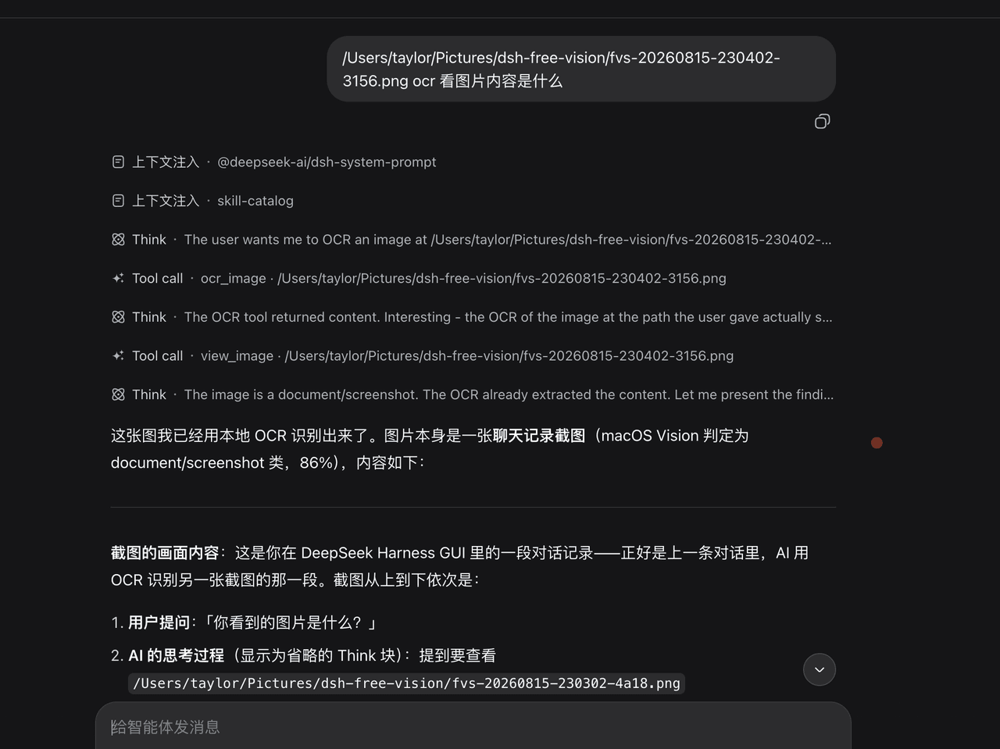
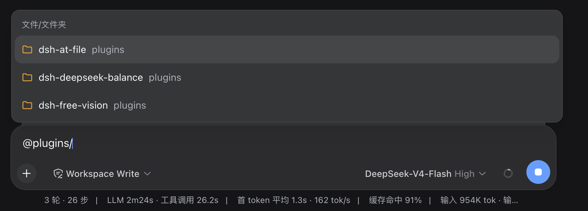
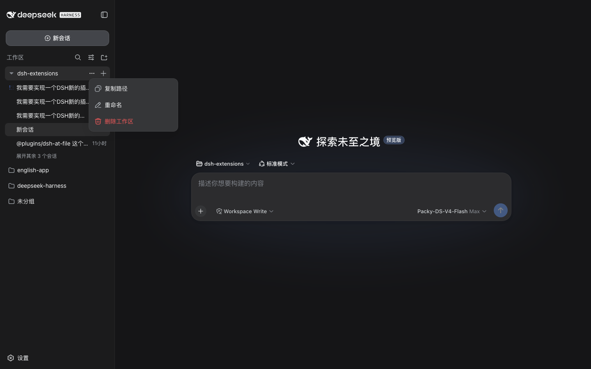

# DeepSeek Harness Plugins

[](LICENSE)
[](https://www.npmjs.com/search?q=%40freespace8)

A collection of open-source plugins for [DeepSeek Harness](https://github.com/deepseek-ai/deepseek-harness) — the plugin-based AI development environment where "everything is a plugin".

Every plugin in this repository is published as an **independent npm package**
under the `@freespace8` scope, installable into any DSH profile on its own.
Each package ships a host half (Cordis plugin, plain ESM) and a client half
(browser bundle), with source kept in `plugins/<name>/`.

**English** · [简体中文](README.zh-CN.md)

---

## Table of contents

- [Plugins](#plugins)
- [Prerequisites](#prerequisites)
- [Development](#development)
  - [Repository layout](#repository-layout)
  - [Adding a new plugin](#adding-a-new-plugin)
  - [Conventions](#conventions)
- [Verification](#verification)
- [Contributing](#contributing)
- [License](#license)

## Plugins

### @freespace8/dsh-deepseek-balance

Official DeepSeek API balance pill in the Web GUI session header,
with a 高价/平价 countdown; click-to-refresh and timed refresh.
See [README](plugins/dsh-deepseek-balance/README.md).


### @freespace8/dsh-free-vision

Local image understanding for vision-less models: OCR, table-layout
detection, and semantic description of textless images (macOS Vision, fully
on-device), plus paste-image → local path in the Web GUI.
See [README](plugins/dsh-free-vision/README.md).



### @freespace8/dsh-at-file

Codex-style `@` path mentions: type `@` in the composer to pick a workspace
file/folder, reference its path, and let the host validate & mark it on send
(contents are never read). See [README](plugins/dsh-at-file/README.md).



### @freespace8/dsh-sidebar-helper

Right-click context menus for the workspace sidebar, built by reusing the
built-in "⋯" row menus: the **workspace menu itself carries Copy Path**
(injected as the first item, next to Rename — via left-click on "⋯",
right-click on the row, or keyboard), and conversation rows open the row's
own untouched menu (Rename / Fork / Archive — identical to the three dots).
See [README](plugins/dsh-sidebar-helper/README.md).



## Prerequisites

- [DeepSeek Harness](https://github.com/deepseek-ai/deepseek-harness) with a
  running `web` profile (Node.js `^22.19.0` or `>=24.0.0`).
- `dsh-free-vision` additionally requires **macOS 11+** with Xcode Command
  Line Tools (`xcode-select --install`).

## Development

### Repository layout

```
plugins/
├── dsh-deepseek-balance/   # official DeepSeek API balance pill
├── dsh-free-vision/        # local macOS Vision OCR / image understanding
├── dsh-at-file/            # Codex-style @ path mentions
└── dsh-sidebar-helper/     # sidebar right-click context menus + copy path
```

Each plugin is self-contained: `src/` (host), `lib/client.js` (browser
bundle), `cordis.patch.yml` (bundle patch line), `tests/` (artifact gate),
plus its own `README.md` and `LICENSE`.

### Adding a new plugin

1. Copy the skeleton from `plugins/dsh-deepseek-balance`
   (`package.json`, `cordis.patch.yml`, `src/index.js`, `lib/client.js`,
   `README.md`, `tests/check.mjs`) and rename it to a scoped
   `@freespace8/<name>`.
2. Implement the host half in `src/index.js`
   (`export const name` + `export const Config` + `apply(ctx, config)`) and
   the client half in `lib/client.js`
   (`window.__ModuleLoader__.load({ id: <package name>, factory })`).
3. Keep three identifiers in sync: the `package.json` name, the `name` field
   of the `cordis.patch.yml` insert line (quote scoped names), and the client
   bundle `id`.
4. Add an artifact-gate check in `tests/check.mjs` and make sure
   `npm run check` passes.
5. Publish with `npm publish` (`publishConfig.access` is already `public`),
   then add the plugin to the [Plugins](#plugins) section of this README.

### Conventions

- **Zero-build**: hosts are plain ESM with no third-party imports beyond
  `@deepseek-ai/schemastery` (plus `zod` / `@deepseek-ai/dsh-llm` where the
  host genuinely needs them); clients use `React.createElement` with no
  bundler. No `tsc` / `tsdown` pipeline is required.
- **Host ↔ client communication** (either is fine):
  - *HTTP route* — the host registers `/plugins/<package>/...` and the client
    `fetch`es it (see `dsh-deepseek-balance`);
  - *Typert Remote* — the host registers with `ctx.typert.register` +
    `TypertRemoteService`, the client mounts with `ctx.remote.$mount`
    (see `dsh-at-file`; third-party packages can extend typert endpoints, no
    longer limited by the api-remotes allow-list).
- **Tunables go into Config**: clients have no config channel, so values the
  client needs (e.g. refresh intervals) are delivered via the host route
  response or Remote `getSettings`.
- **Registration is an effect**: routes, styles, and subscriptions are
  registered through `ctx.effect` / `ctx.on` so they are cleaned up on
  dispose.

## Verification

Run the artifact gate for the plugin you changed (from the plugin directory):

```sh
npm run check
```

This validates syntax, export shapes, `exports`/`files` consistency, patch
lines, and client bundle ids without booting a profile. Real-behavior
verification is done by installing a plugin into a profile and testing in the
GUI (see each plugin's README).

## Contributing

Contributions are welcome! Please read [CONTRIBUTING.md](CONTRIBUTING.md)
first, and check [SECURITY.md](SECURITY.md) before reporting a vulnerability.
Bug reports and feature requests go to the
[issue tracker](https://github.com/freespace8/dsh-plugins/issues).

## License

MIT. See [LICENSE](LICENSE). Third-party attributions for derived code are
documented in each plugin's own `LICENSE`:

- `dsh-at-file` — independent implementation of the `@`-mention concept from
  [dsh-at-file](https://github.com/FSMargoo/dsh-at-file) (MIT).
- `dsh-free-vision` — adaptation of
  [free-vision-skill](https://github.com/niyongsheng/free-vision-skill) (MIT).
