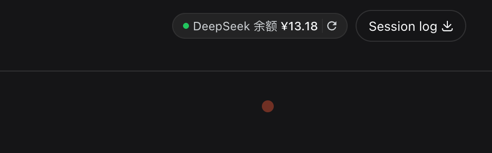

# @freespace8/dsh-deepseek-balance

[](LICENSE)

DeepSeek Harness 插件：在 Web GUI 的会话头部（Session log 左侧）以胶囊形式显示**官方 DeepSeek API 余额**。仅当会话当前模型为官方 DeepSeek 时显示，第三方中转/代理模型自动隐藏。

[English](README.md) · **简体中文**

---

## 目录

- [功能](#功能)
- [预览](#预览)
- [前置条件](#前置条件)
- [安装](#安装)
- [配置](#配置)
- [工作原理](#工作原理)
- [验证](#验证)
- [许可证](#许可证)

## 功能

- 会话头部显示官方余额 `¥xx.xx`（无货币后缀）；
- **仅当会话当前模型是官方 DeepSeek**（provider 为 `deepseek-official`，即 `api.deepseek.com`）时显示；第三方中转/代理模型自动隐藏；
- 鼠标悬停显示赠送/充值明细与上次刷新耗时；
- 胶囊内刷新按钮点击立即刷新（图标旋转动画），并每 5 分钟自动刷新一次；
- **无缓存**：每次刷新都真实请求官方接口；失败时保留上次余额并红点提示。

## 预览

插件运行时的效果（会话头部 Session log 左侧的余额胶囊）：



> **显示条件**：余额胶囊只会在**会话当前模型为官方 DeepSeek** 时显示——即 provider 为 `deepseek-official`（`api.deepseek.com`）。如果对话选择的是**非官方 DeepSeek**（第三方中转/代理模型），胶囊不会显示；只有切回官方 DeepSeek 模型才会重新出现。

## 前置条件

- [DeepSeek Harness](https://github.com/deepseek-ai/deepseek-harness)，带运行中的 `web` profile；
- 已配置官方 DeepSeek API Key：`~/.dsh/.credentials.yaml` 里有 `DEEPSEEK_API_KEY`（或已配置同名环境变量）。

## 安装

已发布到 npm，一条命令安装（目标 profile 为 `web`）：

```sh
dsh plugin --profile web add @freespace8/dsh-deepseek-balance
```

安装后**重启 web profile**（`dsh plugin add` 只改 manifest 与依赖，运行中的实例不热加载新 bundle）。卸载：

```sh
dsh plugin --profile web remove @freespace8/dsh-deepseek-balance
```

## 配置

profile 的 `cordis.patch.yml` 里按 id 覆盖（整段替换 config）：

```yaml
- id: deepseek-balance
  config:
    apiKeyEnv: DEEPSEEK_API_KEY   # 余额请求使用的凭据名
    refreshIntervalMs: 300000     # 自动刷新间隔（毫秒）
    order: -1                     # 会话头部胶囊的排列序（越小越靠前）
    shellTimeoutMs: 8000          # 拉取余额的 shell 总超时（毫秒）
```

## 工作原理

- **host 半体**（`src/index.js`）：经 `ctx.credentials` 解析 API Key，用 `ctx.shell` 执行
  `curl https://api.deepseek.com/user/balance`，注册 HTTP 路由
  `/plugins/dsh-deepseek-balance/balance` 把结果（含刷新间隔配置）发给浏览器；
- **client 半体**（`lib/client.js`）：注册 `conversation.session.header.utilities` slot 条目；
  用 `ctx.modelDirectories` 读会话当前模型做显示判定；`fetch` 余额路由渲染胶囊。

余额数据始终来自**官方 DeepSeek 接口**（用存储的官方 Key），与模型流量走哪个供应商无关；
显示与否只看会话当前模型是否官方 DeepSeek。

## 验证

```sh
npm run check   # 产物门检查（语法、导出形状、exports/files、patch 行、client id）
```

真实生效验证（装进 profile 后）：重启 web profile → 打开一个**已建会话** → 头部出现余额胶囊；
把模型切到第三方中转模型 → 胶囊消失；切回官方 DeepSeek → 胶囊恢复。

## 许可证

MIT，见 [LICENSE](LICENSE)。本插件为原创，不包含第三方代码。
